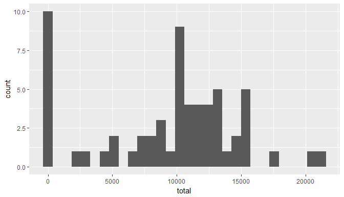
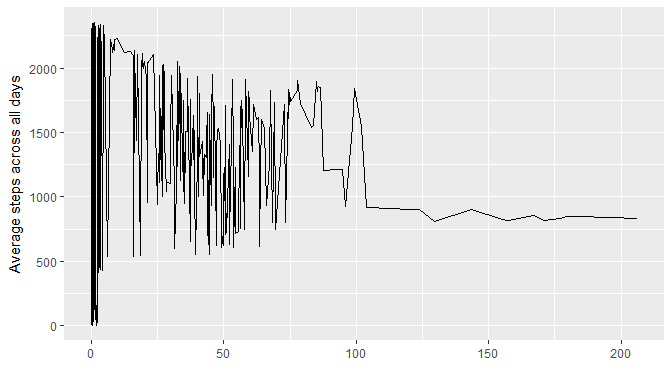
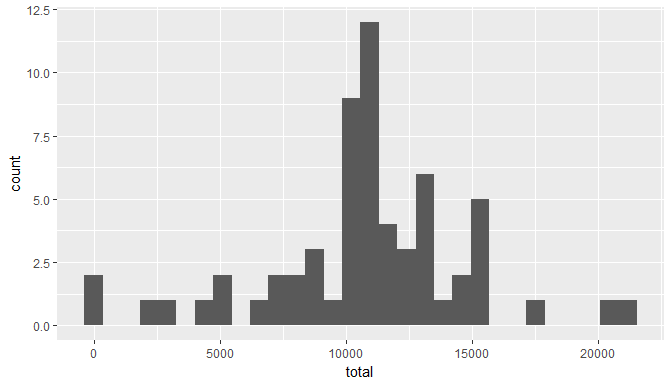
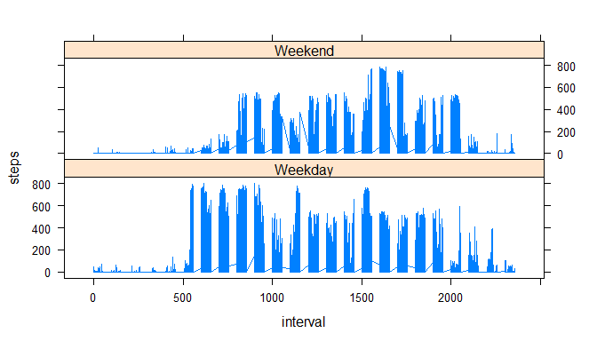

# Reproducible Research: Peer Assessment 1


## Loading and preprocessing the data

1. Load the data (i.e. `read.csv()`)


2. Process/transform the date column into the date format


## What is mean total number of steps taken per day?
1. Make a histogram of the total number of steps taken each day


<!-- -->

2. Calculate and report the **mean** and **median** total number of steps taken per day

```
##    Min. 1st Qu.  Median    Mean 3rd Qu.    Max. 
##       0    6778   10400    9354   12810   21190
```

The mean of the total number of steps taken per day: **9354.23**
and the median of the total number of steps taken per day: **10395**

## What is the average daily activity pattern?
1. Make a time series plot (i.e. `type = "l"`) of the 5-minute interval (x-axis) and the average number of steps taken, averaged across all days (y-axis)


<!-- -->

2. Which 5-minute interval, on average across all the days in the dataset, contains the maximum number of steps?

The 5-minute interval with the maximum number of steps is **835**

## Imputing missing values

1. Calculate and report the total number of missing values in the dataset (i.e. the total number of rows with `NA`s)

The number of missing values is **2304**

2. Devise a strategy for filling in all of the missing values in the dataset. The strategy does not need to be sophisticated. For example, you could use the mean/median for that day, or the mean for that 5-minute interval, etc.

The Strategy used is when we find NA we replace by the mean of that specific 5-minute interval


3. Create a new dataset that is equal to the original dataset but with the missing data filled in.


4. Make a histogram of the total number of steps taken each day and Calculate and report the **mean** and **median** total number of steps taken per day. Do these values differ from the estimates from the first part of the assignment? What is the impact of imputing missing data on the estimates of the total daily number of steps?

<!-- -->


```
##    Min. 1st Qu.  Median    Mean 3rd Qu.    Max. 
##      41    9819   10770   10770   12810   21190
```

The mean of the total number of steps taken per day: **10766.19**
and the median of the total number of steps taken per day: **10766.19**

Generally, the total number of steps per day increased.
This also increased the average and the median of the total number of steps per day. 


## Are there differences in activity patterns between weekdays and weekends?

1. Create a new factor variable in the dataset with two levels - "weekday" and "weekend" indicating whether a given date is a weekday or weekend day.


2. Make a panel plot containing a time series plot (i.e. type = "l") of the 5-minute interval (x-axis) and the average number of steps taken, averaged across all weekday days or weekend days (y-axis). See the README file in the GitHub repository to see an example of what this plot should look like using simulated data.
<!-- -->

